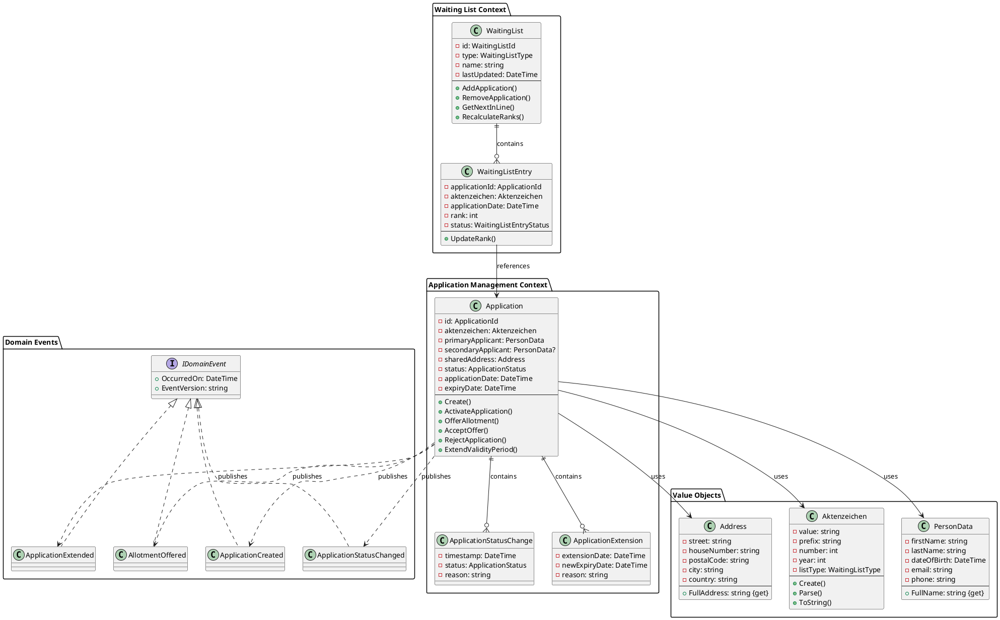
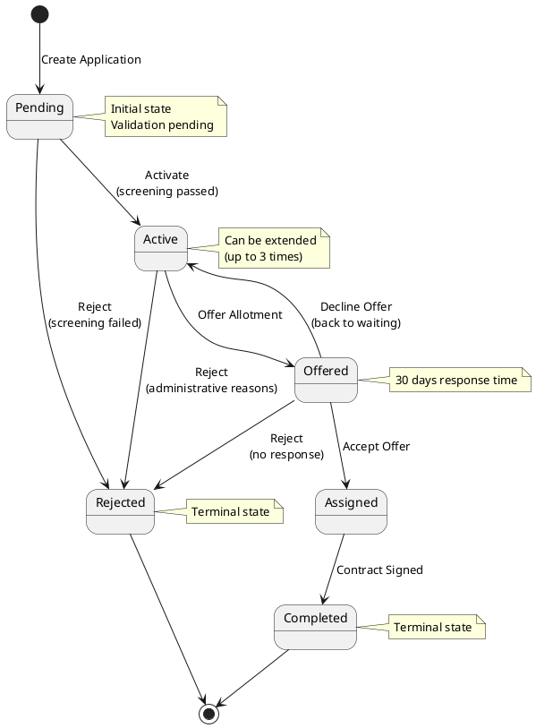

# KGV-System Domain Model Dokumentation

## Übersicht

Diese Dokumentation definiert das Domain Model für das KGV (Kleingartenverwaltung) System als Single Source of Truth. Das Model ist darauf ausgelegt, stabil und unveränderlich zu sein, um Konsistenz in der gesamten Anwendungsentwicklung zu gewährleisten.

## 🏗️ Architecture Decision Records (ADRs)

### ADR-001: Bounded Context Separation
**Status**: Akzeptiert  
**Datum**: 2024-12-07  
**Entscheidung**: Aufteilung in 4 logische Bounded Contexts

**Context**:
Das KGV-System umfasst verschiedene fachliche Bereiche, die unterschiedliche Geschäftsregeln und Lebenzyklen haben.

**Entscheidung**:
- **Application Management Context**: Kern-Antragsverarbeitung
- **Waiting List Context**: FIFO-Ranking und Warteschlangen
- **Geography Context**: Geografische Hierarchie und Parzellen  
- **Audit Context**: Unveränderlicher Audit-Trail

**Begründung**:
- Minimiert Abhängigkeiten zwischen fachlichen Bereichen
- Ermöglicht unabhängige Evolution der Kontexte
- Verbessert Testbarkeit und Wartbarkeit
- Event-basierte Integration zwischen Kontexten

**Konsequenzen**:
- Komplexere Architektur, aber bessere Skalierbarkeit
- Event-Consistency statt Strong-Consistency zwischen Kontexten

---

### ADR-002: Aggregate Root Design
**Status**: Akzeptiert  
**Datum**: 2024-12-07  
**Entscheidung**: Application als zentrale Aggregate Root

**Context**:
Bestimmung der Consistency Boundaries und Transaction-Grenzen.

**Entscheidung**:
```
Application Aggregate:
- Application (Root)  
- ApplicationStatusChange (Entity)
- ApplicationExtension (Entity)

WaitingList Aggregate:
- WaitingList (Root)
- WaitingListEntry (Entity)
```

**Begründung**:
- Application kapselt alle geschäftsrelevanten Invarianten
- WaitingList als separates Aggregate verhindert Lock-Contention
- Kleinere Aggregates = bessere Performance

---

### ADR-003: Value Objects vs Entities
**Status**: Akzeptiert  
**Datum**: 2024-12-07  
**Entscheidung**: Typsichere Value Objects für fachliche Konzepte

**Implementierung**:
- **Value Objects**: Aktenzeichen, PersonData, Address, GeographyCoordinate
- **Entities**: Application, WaitingList, Parzelle
- **Strong Typing**: Keine Primitive Obsession (string, int, DateTime)

**Begründung**:
- Verhindert fehlerhafte Zuweisungen (z.B. PersonName an Address)
- Kapselt Validierungslogik in Value Objects
- Immutable Design für Thread-Safety
- Bessere Ausdrucksstärke im Code

---

### ADR-004: Event Sourcing Compatibility
**Status**: Akzeptiert  
**Datum**: 2024-12-07  
**Entscheidung**: Event Schema mit Versionierung

**Event Design**:
```csharp
public record ApplicationCreated : IDomainEvent
{
    public string EventVersion { get; init; } = "1.0.0";
    // ... properties
}
```

**Schema Evolution**:
- Additive Changes: Neue optionale Properties
- Breaking Changes: Neue Event-Version
- JSON Schema für Serialisierung/Deserialisierung
- Event Upcasting für Backward Compatibility

**Begründung**:
- Unterstützt zukünftige Event Sourcing Implementation
- Ermöglicht Audit-Trail und Replay-Funktionalität
- Vorbereitung auf CQRS-Pattern

---

## 🎯 Bounded Contexts

### 1. Application Management Context

**Zweck**: Verwaltung des kompletten Lebenszyklus von Kleingarten-Bewerbungen

**Kern-Entities**:
- `Application` (Aggregate Root)
- `ApplicationStatusChange`
- `ApplicationExtension`

**Value Objects**:
- `Aktenzeichen`
- `PersonData`
- `Address`

**Domain Events**:
- `ApplicationCreated`
- `ApplicationStatusChanged`
- `ApplicationExtended`
- `AllotmentOffered`

**Business Rules**:
```csharp
// Gültigkeitsdauer
public const int InitialValidityMonths = 12;
public const int ExtensionMonths = 12;
public const int MaxExtensions = 3;

// Status-Übergänge
Pending → {Active, Rejected}
Active → {Offered, Rejected}  
Offered → {Assigned, Active, Rejected}
Assigned → {Completed}
```

### 2. Waiting List Context

**Zweck**: FIFO-basiertes Ranking für beide Wartelisten (Nr32/Nr33)

**Kern-Entities**:
- `WaitingList` (Aggregate Root)
- `WaitingListEntry`

**Business Rules**:
```csharp
// FIFO-Ranking
rank = entries.Count(e => e.ApplicationDate < newApplicationDate) + 1;

// Automatische Neuberechnung
private void RecalculateRanks()
{
    var sorted = entries.OrderBy(e => e.ApplicationDate).ToList();
    for (int i = 0; i < sorted.Count; i++)
        sorted[i].UpdateRank(i + 1);
}
```

### 3. Geography Context

**Zweck**: Hierarchische Verwaltung der geografischen Strukturen

**Hierarchie**:
```
Bezirk (1:N) ↔ (N:M) Katasterbezirk
    ↓
Gemarkung
    ↓  
Flur
    ↓
Parzelle
```

**Integration**: Event-basiert mit Application Context für Wunschgemarkungen

### 4. Audit Context

**Zweck**: Unveränderlicher Audit-Trail aller Geschäftsoperationen

**Pattern**: Event Sourcing mit immutable Events
**Retention**: 10 Jahre für rechtliche Compliance

---

## 🔧 Implementierung

### Core Domain Types

```csharp
// Domain Identity Types
public sealed record ApplicationId(Guid Value) : IEntityId
{
    public static ApplicationId New() => new(Guid.NewGuid());
    public static ApplicationId From(string value) => new(Guid.Parse(value));
}

public sealed record WaitingListId(Guid Value) : IEntityId
{
    public static WaitingListId New() => new(Guid.NewGuid());
    public static WaitingListId From(string value) => new(Guid.Parse(value));
}

// Base Aggregate Root
public abstract class AggregateRoot<TId> where TId : IEntityId
{
    private readonly List<IDomainEvent> _domainEvents = new();
    
    public TId Id { get; protected set; }
    public DateTime CreatedAt { get; protected set; }
    public DateTime? UpdatedAt { get; protected set; }
    
    public IReadOnlyList<IDomainEvent> DomainEvents => _domainEvents.AsReadOnly();
    
    protected void AddDomainEvent(IDomainEvent domainEvent)
    {
        _domainEvents.Add(domainEvent);
    }
    
    public void ClearDomainEvents()
    {
        _domainEvents.Clear();
    }
}
```

### Value Objects Implementation

```csharp
public sealed record Aktenzeichen
{
    private static readonly Regex Pattern = 
        new(@"^(32\.2|33\.2)\s+(\d+)\s+(\d{4})$", RegexOptions.Compiled);
    
    public string Value { get; }
    public string Prefix { get; }
    public int Number { get; }
    public int Year { get; }
    public WaitingListType ListType { get; }
    
    private Aktenzeichen(string value, string prefix, int number, int year, WaitingListType listType)
    {
        Value = value;
        Prefix = prefix;
        Number = number;
        Year = year;
        ListType = listType;
    }
    
    public static Result<Aktenzeichen> Create(WaitingListType listType, int number, int year)
    {
        if (number <= 0) 
            return Result.Failure<Aktenzeichen>("Number must be positive");
        if (year < 2000 || year > DateTime.Now.Year + 1) 
            return Result.Failure<Aktenzeichen>("Invalid year");
            
        var prefix = listType == WaitingListType.Nr32 ? "32.2" : "33.2";
        var value = $"{prefix} {number} {year}";
        
        return Result.Success(new Aktenzeichen(value, prefix, number, year, listType));
    }
    
    public static Result<Aktenzeichen> Parse(string value)
    {
        if (string.IsNullOrWhiteSpace(value))
            return Result.Failure<Aktenzeichen>("Aktenzeichen cannot be empty");
            
        var match = Pattern.Match(value.Trim());
        if (!match.Success)
            return Result.Failure<Aktenzeichen>($"Invalid format: {value}");
            
        var prefix = match.Groups[1].Value;
        var number = int.Parse(match.Groups[2].Value);
        var year = int.Parse(match.Groups[3].Value);
        var listType = prefix == "32.2" ? WaitingListType.Nr32 : WaitingListType.Nr33;
        
        return Result.Success(new Aktenzeichen(value, prefix, number, year, listType));
    }
    
    public override string ToString() => Value;
    
    public static implicit operator string(Aktenzeichen aktenzeichen) => aktenzeichen.Value;
}

public enum WaitingListType
{
    Nr32,
    Nr33
}
```

### Domain Events Schema

```csharp
public interface IDomainEvent
{
    DateTime OccurredOn { get; }
    string EventVersion { get; }
}

public sealed record ApplicationCreated : IDomainEvent
{
    public string EventVersion { get; init; } = "1.0.0";
    public ApplicationId ApplicationId { get; init; }
    public Aktenzeichen Aktenzeichen { get; init; }
    public PersonData PrimaryApplicant { get; init; }
    public PersonData? SecondaryApplicant { get; init; }
    public Address SharedAddress { get; init; }
    public WaitingListType WaitingListType { get; init; }
    public DateTime OccurredOn { get; init; }
    
    public ApplicationCreated(
        ApplicationId applicationId,
        Aktenzeichen aktenzeichen,
        PersonData primaryApplicant,
        PersonData? secondaryApplicant,
        Address sharedAddress,
        WaitingListType waitingListType)
    {
        ApplicationId = applicationId;
        Aktenzeichen = aktenzeichen;
        PrimaryApplicant = primaryApplicant;
        SecondaryApplicant = secondaryApplicant;
        SharedAddress = sharedAddress;
        WaitingListType = waitingListType;
        OccurredOn = DateTime.UtcNow;
    }
}
```

---

## 📋 Business Rules Katalog

### Antragsverwaltung

#### BR-001: Dual-Person Support
```csharp
public static void ValidateDualPersonApplication(PersonData person1, PersonData person2)
{
    // Regel: Zwei verschiedene Personen erforderlich
    if (person1.FirstName == person2.FirstName && 
        person1.LastName == person2.LastName && 
        person1.DateOfBirth == person2.DateOfBirth)
    {
        throw new DomainValidationException(
            "Dual-person application requires different persons");
    }
    
    // Regel: Beide Personen müssen volljährig sein
    ValidateAge(person1.DateOfBirth);
    ValidateAge(person2.DateOfBirth);
}
```

#### BR-002: Aktenzeichen-Format
```csharp
// Format: [Präfix] [Laufende Nummer] [Jahr]
// Beispiele: "32.2 128 2024", "33.2 456 2024"
// Präfix bestimmt Warteliste: 32.2 = Nr32, 33.2 = Nr33
```

#### BR-003: Gültigkeitsdauer
```csharp
public static class ValidityRules
{
    public const int InitialValidityMonths = 12;
    public const int ExtensionMonths = 12;
    public const int MaxExtensions = 3;
    
    // Regel: Maximal 4 Jahre Gesamtlaufzeit
    public static DateTime CalculateMaxExpiryDate(DateTime applicationDate)
        => applicationDate.AddMonths(InitialValidityMonths + (MaxExtensions * ExtensionMonths));
}
```

### Wartelisten-Management

#### BR-004: FIFO-Ranking
```csharp
// Regel: Earlier Application Date = Better Rank (lower number)
private int CalculateRankByFIFO(DateTime applicationDate)
{
    var earlierApplicationsCount = _entries.Count(e => e.ApplicationDate < applicationDate);
    return earlierApplicationsCount + 1;
}

// Bei gleichem Datum: ApplicationId als Tie-Breaker
var sortedEntries = _entries
    .OrderBy(e => e.ApplicationDate)
    .ThenBy(e => e.ApplicationId.Value)
    .ToList();
```

#### BR-005: Wartelisten-Separation
```csharp
public enum WaitingListType
{
    Nr32,  // Geografische Gruppe A (z.B. Nordwest Frankfurt)
    Nr33   // Geografische Gruppe B (z.B. Südost Frankfurt)  
}

// Regel: Antrag kann nur auf einer Warteliste stehen
// Regel: Übertrag zwischen Listen nur durch Admin
```

### Status-Übergänge

#### BR-006: Gültige Status-Transitionen
```csharp
public static readonly Dictionary<ApplicationStatus, ApplicationStatus[]> ValidTransitions = new()
{
    [ApplicationStatus.Pending] = new[] { ApplicationStatus.Active, ApplicationStatus.Rejected },
    [ApplicationStatus.Active] = new[] { ApplicationStatus.Offered, ApplicationStatus.Rejected },
    [ApplicationStatus.Offered] = new[] { ApplicationStatus.Assigned, ApplicationStatus.Active, ApplicationStatus.Rejected },
    [ApplicationStatus.Assigned] = new[] { ApplicationStatus.Completed },
    [ApplicationStatus.Rejected] = Array.Empty<ApplicationStatus>(),
    [ApplicationStatus.Completed] = Array.Empty<ApplicationStatus>()
};

// Regel: Nur explizit definierte Übergänge erlaubt
// Regel: Terminal States (Rejected, Completed) sind final
```

---

## 🧪 Testing Strategy

### Unit Tests für Domain Logic

```csharp
[Test]
public void Application_Create_WithValidData_ShouldSucceed()
{
    // Arrange
    var aktenzeichen = Aktenzeichen.Create(WaitingListType.Nr32, 123, 2024).Value;
    var primaryApplicant = new PersonData("Max", "Mustermann", new DateTime(1990, 1, 1), "max@test.de", "123456");
    var address = new Address("Teststraße", "1", "60311", "Frankfurt");
    
    // Act
    var application = Application.Create(aktenzeichen, primaryApplicant, null, address, WaitingListType.Nr32);
    
    // Assert
    Assert.That(application.Status, Is.EqualTo(ApplicationStatus.Pending));
    Assert.That(application.HasSecondaryApplicant, Is.False);
    Assert.That(application.CanBeExtended, Is.True);
    Assert.That(application.DomainEvents.Count, Is.EqualTo(1));
    Assert.That(application.DomainEvents.First(), Is.TypeOf<ApplicationCreated>());
}

[Test]
public void Application_ActivateApplication_FromPending_ShouldSucceed()
{
    // Arrange
    var application = CreateValidApplication();
    
    // Act
    application.ActivateApplication("Initial screening completed");
    
    // Assert
    Assert.That(application.Status, Is.EqualTo(ApplicationStatus.Active));
    Assert.That(application.StatusHistory.Count, Is.EqualTo(2));
    Assert.That(application.DomainEvents.Any(e => e is ApplicationStatusChanged), Is.True);
}

[TestCase(ApplicationStatus.Rejected)]
[TestCase(ApplicationStatus.Completed)]
public void Application_ActivateApplication_FromTerminalState_ShouldThrowException(ApplicationStatus terminalStatus)
{
    // Arrange
    var application = CreateValidApplication();
    SetApplicationStatus(application, terminalStatus); // Test helper
    
    // Act & Assert
    Assert.Throws<InvalidOperationException>(() => 
        application.ActivateApplication("Should not work"));
}
```

### Integration Tests für Aggregates

```csharp
[Test]
public async Task WaitingList_AddApplication_ShouldMaintainFIFOOrder()
{
    // Arrange
    var waitingList = WaitingList.Create(WaitingListType.Nr32);
    var applications = CreateApplicationsWithDifferentDates();
    
    // Act
    foreach (var app in applications.Reverse()) // Add in reverse order
    {
        waitingList.AddApplication(app.Id, app.Aktenzeichen, app.ApplicationDate);
    }
    
    // Assert
    var entries = waitingList.Entries.ToList();
    Assert.That(entries.Count, Is.EqualTo(applications.Count));
    
    // Verify FIFO order (earlier date = lower rank)
    for (int i = 0; i < entries.Count - 1; i++)
    {
        Assert.That(entries[i].ApplicationDate, Is.LessThanOrEqualTo(entries[i + 1].ApplicationDate));
        Assert.That(entries[i].Rank, Is.LessThan(entries[i + 1].Rank));
    }
}
```

---

## 📊 Domain Model Visualization

### Class Diagram (PlantUML)



### State Diagram (Application Lifecycle)



---

## 🔒 Invariants und Constraints

### Domain Invariants

1. **Application Aggregate**:
   ```csharp
   // Ein Antrag muss immer genau ein Aktenzeichen haben
   private void EnsureAktenzeichenExists()
   {
       if (Aktenzeichen == null)
           throw new DomainException("Application must have an Aktenzeichen");
   }
   
   // Dual-Person Anträge müssen verschiedene Personen haben
   private void EnsureDistinctPersons()
   {
       if (SecondaryApplicant != null && PrimaryApplicant.Equals(SecondaryApplicant))
           throw new DomainException("Primary and secondary applicants must be different");
   }
   
   // Status-History muss chronologisch sein
   private void EnsureChronologicalStatusHistory()
   {
       for (int i = 1; i < _statusHistory.Count; i++)
       {
           if (_statusHistory[i].Timestamp < _statusHistory[i-1].Timestamp)
               throw new DomainException("Status history must be chronological");
       }
   }
   ```

2. **WaitingList Aggregate**:
   ```csharp
   // Ränge müssen eindeutig und lückenlos sein
   private void EnsureValidRanks()
   {
       var ranks = _entries.Select(e => e.Rank).OrderBy(r => r).ToList();
       for (int i = 0; i < ranks.Count; i++)
       {
           if (ranks[i] != i + 1)
               throw new DomainException($"Invalid rank sequence at position {i}");
       }
   }
   
   // Jede Bewerbung kann nur einmal in der Liste stehen
   private void EnsureUniqueApplications()
   {
       var duplicates = _entries.GroupBy(e => e.ApplicationId)
           .Where(g => g.Count() > 1)
           .Select(g => g.Key);
           
       if (duplicates.Any())
           throw new DomainException("Duplicate applications in waiting list");
   }
   ```

### Database Constraints

```sql
-- Entity Framework Migrations würden diese Constraints erstellen:

-- Unique Constraints
ALTER TABLE Applications 
ADD CONSTRAINT UK_Applications_Aktenzeichen UNIQUE (Aktenzeichen);

-- Check Constraints  
ALTER TABLE Applications
ADD CONSTRAINT CK_Applications_ExpiryAfterApplication 
CHECK (ExpiryDate > ApplicationDate);

ALTER TABLE Applications
ADD CONSTRAINT CK_Applications_ValidStatus 
CHECK (Status IN ('Pending', 'Active', 'Offered', 'Assigned', 'Rejected', 'Completed'));

-- Foreign Key Constraints
ALTER TABLE ApplicationStatusChanges
ADD CONSTRAINT FK_StatusChanges_Application
FOREIGN KEY (ApplicationId) REFERENCES Applications(Id) ON DELETE CASCADE;

ALTER TABLE WaitingListEntries  
ADD CONSTRAINT FK_WaitingListEntries_Application
FOREIGN KEY (ApplicationId) REFERENCES Applications(Id) ON DELETE CASCADE;
```

---

## 🔄 Event Schema Evolution

### Versioning Strategy

```json
{
  "eventVersioning": {
    "strategy": "Additive Changes + New Versions",
    "backwardCompatibility": "Required",
    "upcasting": "Supported"
  },
  "versionExamples": {
    "ApplicationCreated_v1.0.0": {
      "applicationId": "guid",
      "aktenzeichen": "string",
      "primaryApplicant": "PersonData",
      "sharedAddress": "Address"
    },
    "ApplicationCreated_v1.1.0": {
      "applicationId": "guid", 
      "aktenzeichen": "string",
      "primaryApplicant": "PersonData",
      "secondaryApplicant": "PersonData?",  // ADDED
      "sharedAddress": "Address",
      "waitingListType": "WaitingListType"  // ADDED
    },
    "ApplicationCreated_v2.0.0": {
      // Breaking change: New event structure
      "applicationId": "guid",
      "applicationData": "ApplicationSnapshot",  // RESTRUCTURED
      "metadata": "EventMetadata"               // NEW
    }
  }
}
```

### Event Upcasting

```csharp
public class ApplicationCreatedUpcast : IEventUpcast<ApplicationCreated>
{
    public ApplicationCreated Upcast(string eventJson, string fromVersion)
    {
        return fromVersion switch
        {
            "1.0.0" => UpcastFromV1_0_0(eventJson),
            "1.1.0" => UpcastFromV1_1_0(eventJson),
            _ => JsonSerializer.Deserialize<ApplicationCreated>(eventJson)
        };
    }
    
    private ApplicationCreated UpcastFromV1_0_0(string json)
    {
        var legacy = JsonSerializer.Deserialize<ApplicationCreatedV1_0_0>(json);
        return new ApplicationCreated(
            legacy.ApplicationId,
            legacy.Aktenzeichen,
            legacy.PrimaryApplicant,
            null, // SecondaryApplicant didn't exist in v1.0.0
            legacy.SharedAddress,
            WaitingListType.Nr32 // Default value for new field
        );
    }
}
```

---

## 📚 Repository Patterns

### Domain Repository Interface

```csharp
public interface IApplicationRepository
{
    // Basic CRUD
    Task<Application?> GetByIdAsync(ApplicationId id);
    Task<Application?> GetByAktenzeichenAsync(Aktenzeichen aktenzeichen);
    Task<bool> ExistsAsync(ApplicationId id);
    Task AddAsync(Application application);
    void Update(Application application);
    
    // Business Queries
    Task<IReadOnlyList<Application>> GetByStatusAsync(ApplicationStatus status);
    Task<IReadOnlyList<Application>> GetExpiringApplicationsAsync(DateTime beforeDate);
    Task<IReadOnlyList<Application>> GetByWaitingListTypeAsync(WaitingListType type);
    Task<PagedResult<Application>> GetPagedAsync(ApplicationFilter filter, PagingParameters paging);
    
    // Validation Queries
    Task<bool> AktenzeichenExistsAsync(Aktenzeichen aktenzeichen);
    Task<int> CountByStatusAsync(ApplicationStatus status);
    
    // Persistence
    Task<int> SaveChangesAsync(CancellationToken cancellationToken = default);
}

public interface IWaitingListRepository
{
    Task<WaitingList?> GetByTypeAsync(WaitingListType type);
    Task<WaitingListEntry?> GetApplicationEntryAsync(ApplicationId applicationId);
    Task<int> GetCurrentRankAsync(ApplicationId applicationId, WaitingListType type);
    Task<IReadOnlyList<WaitingListEntry>> GetTopEntriesAsync(WaitingListType type, int count);
    Task AddAsync(WaitingList waitingList);
    void Update(WaitingList waitingList);
    Task<int> SaveChangesAsync(CancellationToken cancellationToken = default);
}
```

---

## ✅ Validierung und Fehlerbehandlung

### Domain Exception Hierarchy

```csharp
// Base Domain Exception
public abstract class DomainException : Exception
{
    public string DomainArea { get; }
    
    protected DomainException(string domainArea, string message) : base(message)
    {
        DomainArea = domainArea;
    }
    
    protected DomainException(string domainArea, string message, Exception innerException) 
        : base(message, innerException)
    {
        DomainArea = domainArea;
    }
}

// Specific Domain Exceptions
public class ApplicationValidationException : DomainException
{
    public ApplicationValidationException(string message) 
        : base("ApplicationManagement", message) { }
}

public class WaitingListValidationException : DomainException  
{
    public WaitingListValidationException(string message)
        : base("WaitingList", message) { }
}

public class BusinessRuleViolationException : DomainException
{
    public string RuleName { get; }
    
    public BusinessRuleViolationException(string ruleName, string message)
        : base("BusinessRules", message)
    {
        RuleName = ruleName;
    }
}
```

### Result Pattern für Value Objects

```csharp
public class Result<T>
{
    public bool IsSuccess { get; }
    public bool IsFailure => !IsSuccess;
    public T Value { get; }
    public string Error { get; }
    
    private Result(bool isSuccess, T value, string error)
    {
        IsSuccess = isSuccess;
        Value = value;
        Error = error;
    }
    
    public static Result<T> Success(T value) => new(true, value, null);
    public static Result<T> Failure(string error) => new(false, default, error);
    
    public static implicit operator Result<T>(T value) => Success(value);
}

// Usage in Value Objects
public static Result<Aktenzeichen> Create(WaitingListType listType, int number, int year)
{
    if (number <= 0) 
        return Result<Aktenzeichen>.Failure("Number must be positive");
    if (year < 2000 || year > DateTime.Now.Year + 1) 
        return Result<Aktenzeichen>.Failure("Invalid year");
        
    // ... creation logic
    return aktenzeichen;
}
```

---

## 📖 Zusammenfassung

Dieses Domain Model ist als **Single Source of Truth** für die gesamte KGV-System Entwicklung konzipiert:

### ✅ **Stabilität gewährleistet durch**:
- Immutable Value Objects
- Klar definierte Aggregate Boundaries  
- Versionierte Domain Events
- Umfassende Business Rule Validierung

### ✅ **Event Sourcing Ready**:
- Schema-versionierte Events
- Event Upcasting Support
- Immutable Event Design
- Backward Compatibility

### ✅ **Testbarkeit**:
- Domain Logic isoliert von Infrastructure
- Pure Functions in Business Rules
- Mocking-freundliche Repository Interfaces
- Umfassende Unit Test Strategie

### ✅ **Erweiterbarkeit**:
- Additive Schema Evolution
- Event-basierte Bounded Context Integration
- Plugin-fähige Validation Rules
- Performance-optimierte Aggregate Design

**Dieses Domain Model kann als unveränderliche Basis für die gesamte Anwendungsentwicklung verwendet werden und verhindert die beschriebenen Probleme mit sich ändernden Domänenobjekten.**