# 📋 KGV-Projekt Management Guide

## 🎯 Übersicht

Dieser Guide definiert die Projekt-, Issue- und Meilensteinverwaltung für das KGV-System. Ziel ist eine strukturierte Entwicklung mit **kleinen, umsetzbaren Issues** die in **maximal 1-2 Tagen** von einem Entwickler implementiert werden können.

---

## 🏗️ Projekt-Struktur

### **Hauptprojekt: KGV-v2 Development**
```
Repository: andrekirst/kgv-v2
Project: KGV-v2 Development (GitHub Projects v2)
Board Views:
├── 📊 Backlog (alle Issues)
├── 🏃 Active Sprint (aktueller 2-Wochen Sprint)
├── 🎯 Milestones (Meilenstein-Übersicht)  
└── 👥 By Assignee (Entwickler-spezifisch)
```

### **Meilenstein-Organisation**
Basierend auf der 4-Phasen Migrationsstrategie:

| Meilenstein | Dauer | Issues | Entwicklertage | Beschreibung |
|-------------|-------|--------|----------------|--------------|
| **M1: Foundation** | 8-10 Wochen | 20 Issues | 40 Tage | Domain Model, Basic API, Auth |
| **M2: Core Features** | 10-12 Wochen | 30 Issues | 60 Tage | Hauptfunktionalität, UI |
| **M3: Advanced Features** | 8-10 Wochen | 25 Issues | 50 Tage | Workflows, Reports, Mobile |
| **M4: Production Ready** | 6-8 Wochen | 15 Issues | 30 Tage | Security, Performance, Go-Live |

---

## 📝 Issue-Sizing-Philosophie

### **Grundprinzipien**

#### **1. Maximal 1-2 Tage pro Issue**
- **1 Tag**: Einfache Features oder Bug Fixes
- **2 Tage**: Komplexere Features mit Backend + Frontend
- **>2 Tage**: Issue zu groß → aufteilen in mehrere kleinere Issues

#### **2. Full-Stack Ansatz für Features**
Jedes **Feature-Issue** umfasst IMMER:
- ✅ **Backend**: API Endpoints, Business Logic, Database
- ✅ **Frontend**: UI Components, State Management, Integration
- ✅ **Testing**: Unit Tests (Backend), Component Tests (Frontend)
- ✅ **Documentation**: API Docs, Code Comments

#### **3. Single-Layer für Bugs**
Bug-Issues betreffen NUR den fehlerhaften Layer:
- 🐛 **Backend Bug**: Nur Server-seitige Fixes
- 🐛 **Frontend Bug**: Nur Client-seitige Fixes  
- 🐛 **Integration Bug**: Beide Layer, aber als separate Issues

### **Issue-Kategorien**

#### **🚀 Feature Issues**
**Format**: `feat: [Feature-Name] - [Kurzbeschreibung]`
**Beispiel**: `feat: Waiting List Export - Excel/PDF export with filtering`
**Aufwand**: 1-2 Tage
**Umfang**: Backend + Frontend + Tests

#### **🐛 Bug Issues**  
**Format**: `fix: [Bug-Beschreibung] - [Betroffener Layer]`
**Beispiel**: `fix: Aktenzeichen validation fails for valid format - Backend`
**Aufwand**: 0.5-1 Tag
**Umfang**: Nur der betroffene Layer

#### **📚 Task Issues**
**Format**: `task: [Aufgabe] - [Kontext]`
**Beispiel**: `task: Setup CI/CD Pipeline - GitHub Actions`
**Aufwand**: 0.5-2 Tage
**Umfang**: Infrastructure, Documentation, Setup

#### **🔧 Refactor Issues**
**Format**: `refactor: [Komponente] - [Verbesserung]`
**Beispiel**: `refactor: Application Service - Extract validation logic`
**Aufwand**: 1 Tag
**Umfang**: Code-Qualität, Performance, Maintainability

---

## 🎛️ Issue-Management-Workflow

### **Issue-Lifecycle**

```mermaid
graph TD
    A[📝 Issue Created] --> B[🏷️ Labeled & Estimated]
    B --> C[📋 Added to Backlog]
    C --> D[🎯 Sprint Planning]
    D --> E[👤 Assigned to Developer]
    E --> F[🌿 Branch Created]
    F --> G[⚡ Development]
    G --> H[🔄 Pull Request]
    H --> I[👀 Code Review]
    I --> J[✅ Merged]
    J --> K[✨ Issue Closed]
```



### **Issue-Status-Management**

| Status | Beschreibung | Wer ist verantwortlich? |
|--------|--------------|------------------------|
| 📝 **Backlog** | Issue erstellt, wartet auf Priorisierung | Product Owner |
| 🏷️ **Ready** | Labels gesetzt, Acceptance Criteria definiert | Product Owner |
| 🏃 **In Progress** | Aktiv in Entwicklung | Developer |
| 👀 **In Review** | Pull Request erstellt, wartet auf Review | Reviewer |
| ✅ **Done** | Issue abgeschlossen und deployed | Product Owner |

### **Daily Issue-Management**

#### **Morgen-Routine (Developer)**
1. **Status-Check**: Aktuelle Issues in "In Progress" überprüfen
2. **Priority-Check**: Nächstes Issue aus Sprint Backlog wählen  
3. **Branch-Setup**: Feature-Branch nach Namenskonvention erstellen
4. **Domain-Check**: CLAUDE.md und relevante Docs überprüfen

#### **Abend-Routine (Developer)**
1. **Progress-Update**: Issue-Status in GitHub Projects aktualisieren
2. **Commit & Push**: Tagesfortschritt sichern (kleine Commits)
3. **Documentation**: Arbeitsnotizen in Issue-Kommentar
4. **Tomorrow-Planning**: Nächste Schritte definieren

---

## 🏷️ Labeling-System

### **Priority Labels**
- 🔥 **critical** - Blocking issues, sofortige Bearbeitung
- 🚨 **high** - Wichtige Features, nächster Sprint
- 📋 **medium** - Standard-Features, normale Priorität  
- 📝 **low** - Nice-to-have, später bearbeiten

### **Type Labels**
- 🚀 **feature** - Neue Funktionalität
- 🐛 **bug** - Fehlerkorrektur
- 📚 **documentation** - Doku-Updates
- 🔧 **refactor** - Code-Verbesserung
- 🧪 **testing** - Test-Implementation
- 🛠️ **infrastructure** - DevOps, CI/CD

### **Component Labels**
- 🏛️ **domain** - Domain Layer (PROTECTED - siehe CLAUDE.md)
- 💼 **application** - Application Layer
- 🌐 **api** - Web API Controller
- 🖥️ **frontend** - Angular Components
- 🗃️ **database** - Database, Migrations
- 🔐 **auth** - Authentication/Authorization

### **Size Labels**
- 🟢 **size/S** - 0.5-1 Tag (einfache Tasks)
- 🟡 **size/M** - 1-1.5 Tage (Standard Features)
- 🟠 **size/L** - 1.5-2 Tage (komplexere Features)
- 🔴 **size/XL** - >2 Tage (SPLIT REQUIRED!)

---

## 📊 Meilenstein-Planung

### **Meilenstein 1: Foundation (Wochen 1-10)**

#### **Ziele**
- ✅ Technische Grundlagen schaffen
- ✅ Domain Model implementieren
- ✅ Basic API entwickeln
- ✅ Authentication einrichten

#### **Geplante Issues (20 Stück)**

##### **Domain & Architecture (5 Issues)**
1. **Domain Model Setup** - Value Objects implementieren (Aktenzeichen, PersonData, Address) - 2 Tage
2. **Entity Framework Configuration** - DbContext, Entities, Migrations - 1 Tag
3. **Repository Pattern** - Generic Repository + Unit of Work - 1 Tag
4. **CQRS Setup** - MediatR, Commands/Queries Infrastructure - 1.5 Tage
5. **Domain Events Infrastructure** - Event Publishing/Handling - 1.5 Tage

##### **Authentication & Security (4 Issues)**
6. **JWT Authentication** - Token generation, validation, refresh - 2 Tage
7. **User Management** - User Entity, basic CRUD - 1 Tag
8. **Role-based Authorization** - Roles, Permissions, Policies - 1.5 Tage
9. **Security Middleware** - Rate limiting, CORS, Headers - 1 Tag

##### **Core API Endpoints (6 Issues)**
10. **Application CRUD API** - Basic Application management - 2 Tage
11. **Application Status API** - Status changes, validation - 1.5 Tage
12. **Person Management API** - Person CRUD with validation - 1 Tag
13. **Waiting List API** - List management, ranking - 2 Tage
14. **User Management API** - Admin functions - 1 Tag
15. **Health Check API** - Monitoring, diagnostics - 0.5 Tage

##### **Frontend Foundation (5 Issues)**
16. **Angular Project Setup** - CLI, Material, Routing - 1 Tag
17. **Authentication Module** - Login, JWT handling, Guards - 2 Tage
18. **Main Layout Components** - Header, Navigation, Footer - 1 Tag
19. **Form Infrastructure** - Reactive forms, validation - 1.5 Tage
20. **HTTP Interceptor Setup** - Error handling, loading - 1 Tag

### **Meilenstein 2: Core Features (Wochen 11-22)**

#### **Ziele**
- ✅ Hauptfunktionalität implementieren
- ✅ Bürger-Portal entwickeln
- ✅ Verwaltungsportal erstellen
- ✅ Wartelisten-Management

#### **Geplante Issues (30 Stück)**

##### **Bürger-Portal (10 Issues)**
21. **Application Form** - Multi-step wizard für Antragstellung - 2 Tage
22. **Address Autocomplete** - PLZ/Ort API Integration - 1 Tag
23. **Gemarkung Selection** - Interactive map component - 2 Tage
24. **Application Status Tracking** - Status timeline component - 1.5 Tage
25. **Document Upload** - File upload with validation - 1 Tag
26. **Application Preview** - PDF preview generation - 1.5 Tage
27. **Email Notifications** - SMTP integration, templates - 1.5 Tage
28. **Application History** - User's application list - 1 Tag
29. **Profile Management** - User profile editing - 1 Tag
30. **Help & FAQ System** - Static content management - 1 Tag

##### **Verwaltungsportal (12 Issues)**
31. **Admin Dashboard** - Overview widgets, statistics - 2 Tage
32. **Application Management** - List, search, filter applications - 2 Tage
33. **Application Details View** - Detailed view with editing - 1.5 Tage
34. **Bulk Operations** - Mass status changes, exports - 1.5 Tage
35. **Waiting List Management** - List management, ranking - 2 Tage
36. **Manual Ranking** - Drag-drop ranking adjustments - 1.5 Tage
37. **Comment System** - Internal notes, history - 1 Tag
38. **Document Generation** - PDF letters, confirmations - 2 Tage
39. **User Management UI** - Admin user interface - 1.5 Tage
40. **System Configuration** - Settings management UI - 1 Tag
41. **Audit Log Viewer** - Change history display - 1 Tag
42. **Advanced Search** - Complex search filters - 1.5 Tage

##### **Business Logic (8 Issues)**
43. **Aktenzeichen Generation** - Automatic file number creation - 1 Tag
44. **Ranking Algorithm** - FIFO calculation logic - 1.5 Tage
45. **Application Validation** - Business rule validation - 1 Tag
46. **Status Transition Logic** - Workflow state machine - 1.5 Tage
47. **Notification Service** - Email/SMS sending logic - 1 Tag
48. **Document Templates** - PDF template engine - 1.5 Tage
49. **Expiry Management** - Automatic expiry handling - 1 Tag
50. **Statistics Service** - Data aggregation for reports - 1 Tag

### **Meilenstein 3: Advanced Features (Wochen 23-32)**

#### **Ziele**
- ✅ Erweiterte Workflows
- ✅ Reporting System
- ✅ Mobile Optimierung
- ✅ Integration Features

#### **Geplante Issues (25 Stück)**

##### **Advanced Workflows (8 Issues)**
51. **Offer Management** - Offer creation and tracking - 2 Tage
52. **Offer Response System** - Accept/decline workflow - 1.5 Tage
53. **Extension Requests** - Application extension logic - 1.5 Tage
54. **Automatic Reminders** - Email reminder system - 1 Tag
55. **Batch Processing** - Background job processing - 1.5 Tage
56. **Workflow Automation** - State machine automation - 1 Tag
57. **Escalation Management** - Overdue handling - 1 Tag
58. **Calendar Integration** - Appointment scheduling - 1.5 Tage

##### **Reporting & Analytics (7 Issues)**
59. **Report Builder** - Dynamic report creation - 2 Tage
60. **Dashboard Analytics** - Charts, graphs, KPIs - 2 Tage
61. **Export Functions** - Excel, PDF, CSV exports - 1.5 Tage
62. **Historical Reports** - Trend analysis - 1 Tag
63. **Performance Metrics** - System performance tracking - 1 Tag
64. **Compliance Reports** - DSGVO compliance reporting - 1.5 Tage
65. **Scheduled Reports** - Automatic report generation - 1 Tag

##### **Mobile & PWA (5 Issues)**
66. **PWA Configuration** - Service worker, manifest - 1 Tag
67. **Offline Functionality** - Offline form drafts - 1.5 Tage
68. **Push Notifications** - Browser push notifications - 1 Tag
69. **Mobile Optimization** - Touch interfaces, responsive - 1.5 Tage
70. **App-like Features** - Install prompts, shortcuts - 1 Tag

##### **Integration & APIs (5 Issues)**
71. **REST API Documentation** - OpenAPI/Swagger enhancement - 1 Tag
72. **External API Integration** - Third-party services - 1.5 Tage
73. **Webhook System** - Outbound webhook notifications - 1 Tag
74. **Data Import/Export** - Bulk data operations - 1.5 Tage
75. **Legacy System Bridge** - Migration assistance tools - 1 Tag

### **Meilenstein 4: Production Ready (Wochen 33-40)**

#### **Ziele**
- ✅ Security Hardening
- ✅ Performance Optimization
- ✅ Production Deployment
- ✅ Go-Live Vorbereitung

#### **Geplante Issues (15 Stück)**

##### **Security & Performance (8 Issues)**
76. **Security Audit** - Penetration testing, fixes - 2 Tage
77. **Performance Optimization** - Database, API optimization - 2 Tage
78. **Caching Implementation** - Redis caching layer - 1.5 Tage
79. **Load Testing** - Performance testing, optimization - 1.5 Tage
80. **Error Handling** - Global error handling, logging - 1 Tag
81. **Monitoring Setup** - Application monitoring - 1 Tag
82. **Backup Strategy** - Automated backup system - 1 Tag
83. **Disaster Recovery** - Recovery procedures - 1 Tag

##### **Deployment & DevOps (4 Issues)**
84. **Docker Configuration** - Containerization setup - 1 Tag
85. **CI/CD Pipeline** - Automated deployment - 1.5 Tage
86. **Environment Configuration** - Prod/Stage/Dev setup - 1 Tag
87. **SSL/TLS Setup** - Certificate management - 0.5 Tage

##### **Go-Live Preparation (3 Issues)**
88. **Data Migration** - Legacy data import - 1.5 Tage
89. **User Training Materials** - Documentation, tutorials - 1 Tag
90. **Go-Live Monitoring** - Launch day monitoring - 0.5 Tage

---

## ⚙️ Issue-Templates

### **Feature Issue Template**
```markdown
## 🚀 Feature: [Feature Name]

### 📋 Description
Brief description of the feature and its business value.

### 🎯 Acceptance Criteria
- [ ] Backend: API endpoints implemented
- [ ] Frontend: UI components created
- [ ] Testing: Unit tests added
- [ ] Documentation: API docs updated
- [ ] Domain Guard: No domain modifications

### 🏗️ Technical Tasks
#### Backend (API Layer)
- [ ] Create controller endpoints
- [ ] Implement business logic in application layer
- [ ] Add data models and DTOs
- [ ] Write unit tests

#### Frontend (Angular)
- [ ] Create UI components
- [ ] Implement state management
- [ ] Add form validation
- [ ] Write component tests

### 🔗 Related Issues
- Relates to #[number]
- Depends on #[number]

### 📊 Estimation: [1-2 days]

### 🏷️ Labels
feature, size/M, [component-label]
```

### **Bug Issue Template**
```markdown
## 🐛 Bug: [Bug Title]

### 📋 Description
Clear description of the bug and expected behavior.

### 🔄 Steps to Reproduce
1. Step 1
2. Step 2
3. Step 3

### 🎯 Expected Behavior
What should happen.

### 🚨 Actual Behavior
What actually happens.

### 🌍 Environment
- Browser: [if frontend bug]
- API Version: [if backend bug]
- User Role: [if relevant]

### 🛠️ Fix Tasks
- [ ] Identify root cause
- [ ] Implement fix
- [ ] Add regression test
- [ ] Verify fix

### 📊 Estimation: [0.5-1 day]

### 🏷️ Labels
bug, [priority], [component-label]
```

---

## 📈 Metriken und KPIs

### **Development Metrics**

#### **Issue-Flow**
- **Cycle Time**: Zeit von "In Progress" bis "Done"
- **Lead Time**: Zeit von "Created" bis "Done"
- **Throughput**: Abgeschlossene Issues pro Sprint
- **WIP Limit**: Max. 3 Issues "In Progress" pro Developer

#### **Quality Metrics**
- **Bug Rate**: Bugs per 100 abgeschlossene Features
- **Rework Rate**: Issues die wiedereröffnet werden
- **Code Review Time**: Zeit bis PR-Approval
- **Test Coverage**: Min. 80% für neue Features

### **Success Indicators**

#### **Team Performance**
- ✅ **95% Issues** werden in geschätzter Zeit abgeschlossen
- ✅ **<1 Tag** durchschnittliche Cycle Time
- ✅ **Zero** Issues über 2 Tage Entwicklungszeit
- ✅ **100%** Issues haben klare Acceptance Criteria

#### **Project Health**
- ✅ **On Track** - Meilensteine werden erreicht
- ✅ **High Quality** - <5% Bug Rate
- ✅ **Fast Delivery** - <24h von PR zu Deployment
- ✅ **Team Happiness** - Sustainable Development Pace

---

## 🛠️ Tools und Automation

### **GitHub Integration**
```yaml
# .github/workflows/issue-management.yml
name: Issue Management
on:
  issues:
    types: [opened, labeled, assigned]
  
jobs:
  auto-assign-project:
    # Automatically add issues to project board
  validate-issue-size:
    # Check if issue has size estimation
  create-branch:
    # Auto-create feature branch when assigned
```

### **Project Automation**
- **Auto-labeling** basierend auf Issue-Titel-Pattern
- **Size-Estimation** Reminder bei fehlenden size-Labels
- **Sprint Planning** Automation für 2-Wochen-Sprints
- **Burndown Charts** automatische Generierung

### **Integration mit Git-Workflow**
- **Branch Creation**: `feature/123-waiting-list-export`
- **Commit Linking**: `feat(export): implement Excel export - relates to #123`
- **Auto-Close**: Issues schließen bei Merge von `closes #123`
- **Status Sync**: Issue Status mit PR Status synchronisieren

---

**🎯 Fazit**: Diese Struktur gewährleistet planbare, nachverfolgbare Entwicklung mit realistischen Zeitschätzungen und klaren Deliverables. Jedes Issue ist so geschnitten, dass es in maximal 2 Tagen vollständig (Backend + Frontend) implementiert werden kann.